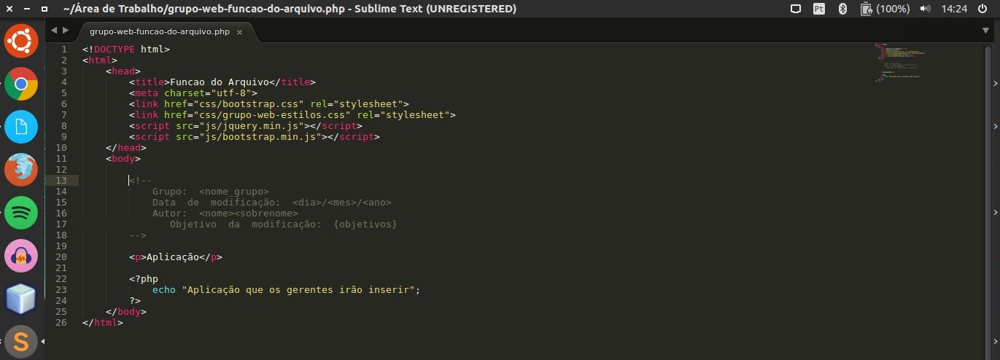
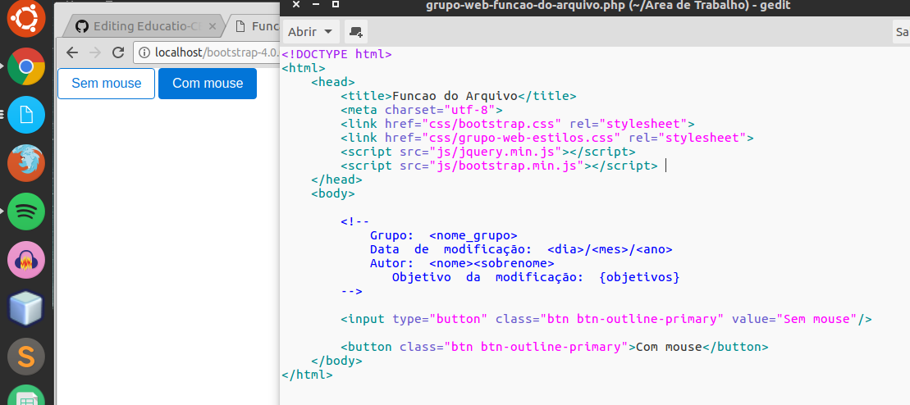

# Padrão Web Bootstrap

Todos os arquivos '.html' deverão ser feitos '.php'. Para isso, crie um arquivo '.php' e o edite como um '.html'. O php referente ao trabalho de vocês continuará sendo em um arquivo php externo. O html só será .php devido ao uso de algumas variáveis em php necessárias para o login sem o uso de js.

# Padrão Web - Botões

Todos os botões deverão usar a classe btn e btn-outline-primary. No caso dessa classe, quando o usuário passa o mouse ou clica sobre o botão ele fica azul. Na imagem eu cliquei no botão. Posteriormente mudaremos a cor deste azul para um mais adequado para o site!

# Padrão Web - Formulário

